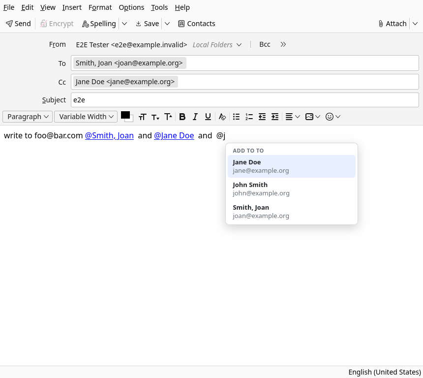

> [!CAUTION]
> This is completely vibe-coded. There is no human code in this project. Use at your own risk.
>
# @Mention Recipients for Thunderbird

[](https://github.com/sahiljhawar/thunderbird-at-mention/actions/workflows/ci.yml)
[](LICENSE)

Type `@` in the Thunderbird compose window, pick a contact from the dropdown, and press Enter.
The contact is added to **To** and mentioned in the message. Type `@@` instead to add them to
**Cc**.



* The dropdown follows what you type. `@jo` and `@john sm` both find *John Smith*. It searches
  name, nickname and address in all your Thunderbird address books, including Collected
  Addresses.
* `@` adds to **To**, `@@` adds to **Cc**. The dropdown header says which.
* **Up** and **Down** move the highlight, **Enter** or **Tab** (or a click) picks, **Esc** closes.
  If nothing matches, Enter does what it always does.
* Typing an email address such as `foo@bar.com` never opens the dropdown.
* The mention stays in the message as `@John Smith`, a link to their address in HTML messages and
  plain text in plain-text messages.
* **Delete the whole mention and the person leaves the field again.** Deleting only part of it
  keeps them, and undo brings them back. Someone who was already in the field before you
  mentioned them is never removed.
* Everything happens locally. The add-on has no network access.

## Install

1. Download `at-mention-<version>.xpi` from the
   [latest release](https://github.com/sahiljhawar/thunderbird-at-mention/releases/latest).
2. In Thunderbird open the menu (the three lines), then **Add-ons and Themes**.
3. Click the gear icon, choose **Install Add-on From File...** and select the downloaded `.xpi`.

Open a **new** compose window after installing: windows that were already open do not get the
add-on. To update, install the newer `.xpi` the same way.

Notes on installing:

* This add-on is not signed by Mozilla. On the official Thunderbird release and ESR builds
  unsigned add-ons install and stay installed. If your build refuses them (some distribution
  packages, or `xpinstall.signatures.required` set to `true`), load it for the current session
  instead: **Add-ons and Themes**, gear icon, **Debug Add-ons**, **Load Temporary Add-on**, and
  pick the `.xpi`. It lasts until Thunderbird restarts.
* Requires Thunderbird 128 or newer.

## Using it

1. In a compose window type `@` followed by a few letters of a name or address.
2. Press **Enter**. The contact appears in **To** and `@Name` is left in your text.
3. Use `@@` in place of `@` to add to **Cc** instead.

If you use the [Markdown Compose Preview](https://github.com/sahiljhawar/thunderbird-markdown-preview)
add-on, mentions are sent as links labelled with the name. This needs a version of that add-on
newer than 1.2.1, which added support for links with their own label.

## What it does not do

* **Bcc** is not supported.
* Contacts that only exist on a remote server (LDAP, or a CardDAV book that never synced) are not
  searched.
* The plain-text part that Thunderbird adds to an HTML message shows a link as
  `@Name <mailto:address>`. That is Thunderbird's own conversion for every link.
* A mention is only tracked while its compose window is open. Reopening a saved draft does not
  reconnect the mentions in it to the To and Cc fields.

## How it works

* `background.js` keeps a cache of your contacts, answers searches and edits the recipient
  fields with `compose.setComposeDetails`. `lib/contacts.js` holds the matching and address
  formatting.
* `compose.js` is a compose script, injected into the editor of every compose window. It watches
  for `@`, draws the dropdown inside a shadow root, and inserts the mention. `lib/core.js` holds
  its pure helpers.
* The dropdown lives in the editor document, so it is removed before sending (the background
  script asks the compose script to clean up from `compose.onBeforeSend`).

Permissions: `addressBooks` to read contacts and `compose` to read and change the recipients.

## Development

```
npm test           # unit tests
npm run lint       # syntax check
npm run package    # builds dist/at-mention-<version>.xpi
npm run e2e        # drives a real headless Thunderbird (needs `thunderbird` on the PATH,
                   # or set THUNDERBIRD=/path/to/thunderbird)
```

`npm run e2e` installs the add-on as a temporary add-on in a throwaway profile under `tbtest/`,
fills the address book, opens compose windows and checks the dropdown, the To and Cc fields, the
body and the message that is sent. With `E2E_SHOT=docs/dropdown.png` it also saves a screenshot.
CI runs it against Thunderbird release, ESR and ESR 128.

To release, bump `version` in `manifest.json` and `package.json`, commit, and push a tag
`v<version>`. The release workflow checks the tag against the manifest, runs the tests and
attaches the `.xpi`.

## License

GPL-3.0-or-later. See [LICENSE](LICENSE).
